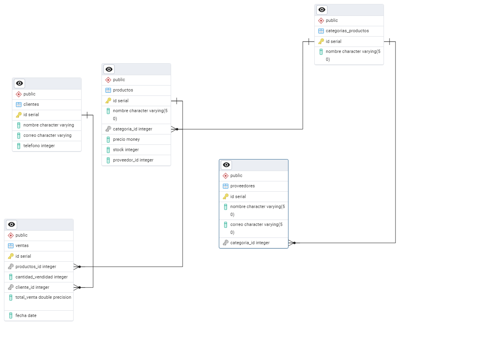

# Examen - Proyecto de Base de Datos

Este repositorio contiene los entregables solicitados para el examen de **Bases de Datos**. A continuación, se detallan los archivos entregados y su contenido.

## clonacion

``git clone https://github.com/osman019/FILTRO_POSTGRESSQL_OSMAN-JOHANDRY-ORTIZ-ROLON-ROLON.git``

## Entregables

### 1. Modelo E-R (modelo_er.png o modelo_er.jpg)

- **Archivo:** `modelo_er.png`  
- 
- **Descripción:** Este archivo contiene el Diagrama Entidad-Relación (E-R) del sistema. En el diagrama se incluyen todas las entidades relevantes, las relaciones entre ellas y las cardinalidades.  
- **Normalización:** El modelo E-R está normalizado hasta la Tercera Forma Normal (3FN) para evitar redundancias y asegurar la eficiencia en las consultas y las operaciones sobre la base de datos.

### 2. Estructura de la Base de Datos (db.sql)

- **Archivo:** `db.sql`  
- **Descripción:** Este archivo SQL contiene el script para la creación de las tablas de la base de datos, incluyendo:
  - Definición de **claves primarias** para identificar de manera única cada registro.
  - Definición de **claves foráneas** para asegurar la integridad referencial entre tablas.
  - Restricciones de **NOT NULL**, **CHECK** y **UNIQUE** para garantizar la calidad y coherencia de los datos.

### 3. Inserción de Datos (insert.sql)

- **Archivo:** `insert.sql`  
- **Descripción:** Este archivo contiene los scripts para insertar al menos 15 registros representativos en cada una de las tablas del modelo. Los datos han sido seleccionados de manera que sean representativos de un escenario realista, garantizando la funcionalidad de las consultas y operaciones de la base de datos.

### 4. Consultas SQL (queries.sql)

- **Archivo:** `queries.sql`
- **Descripción:** Este archivo contiene las consultas avanzadas.
